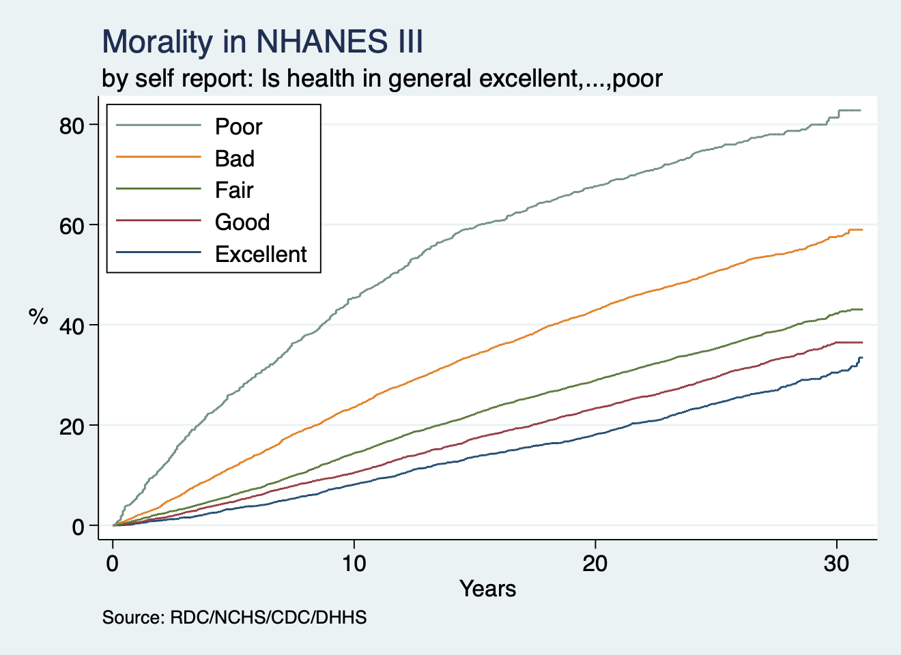

# Results:

We can see from the graph that poor and bad nutrition groups are associated with a higher mortality rate over time.

```stata

use nh3andmort, clear
di "obs: `c(N)' & vars: `c(k)'"      

```

```stata

set scheme s2color
nhanes

```


This shows a flexible program for univariate logistic regression using STATA 17.

```stata

capture program drop unilogit
		program define unilogit
		syntax varlist [if], [outcome(string)] 
		quietly foreach var of varlist `varlist' {
			logistic `outcome' `var' `if', nolog
			lincom `var'
			local sig_p: di %4.3f `r(p)'
			if `sig_p' < 0.05 {
			noi di "`var'" _col(15) "`sig_p'"
			noi di "Significantly associated with `outcome':"
            noi di "`var' (p=`sig_p')"
			noi di ""
			}
		}
	end
	noi unilogit


```
